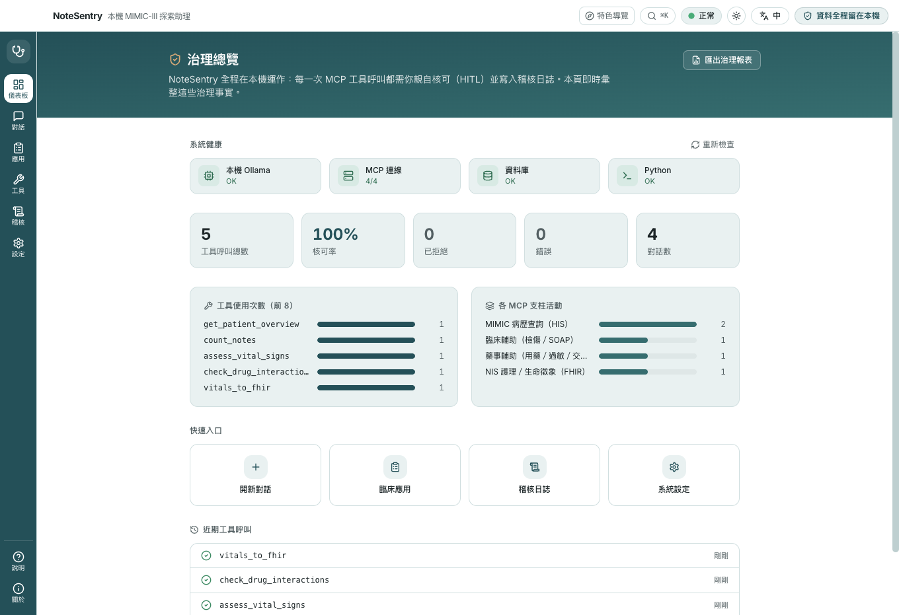
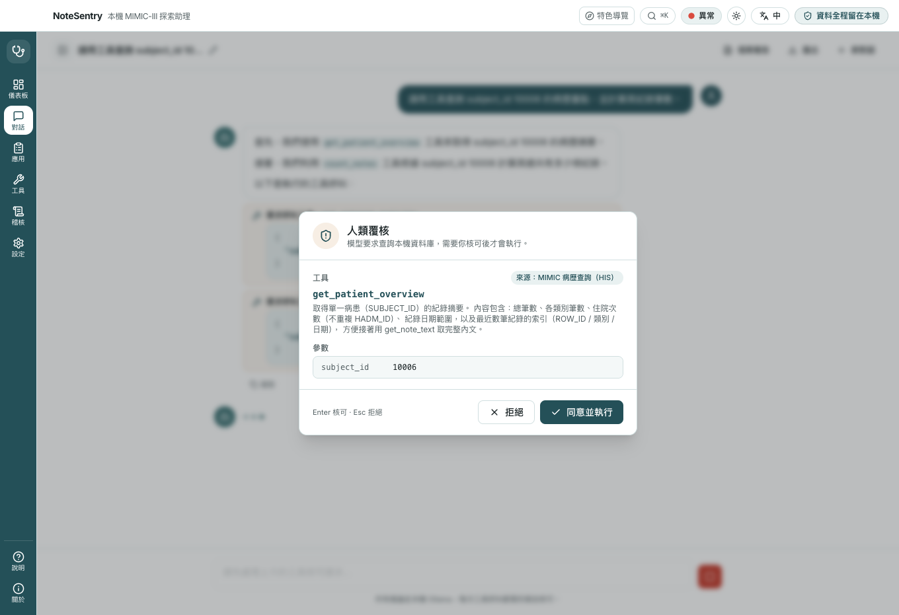
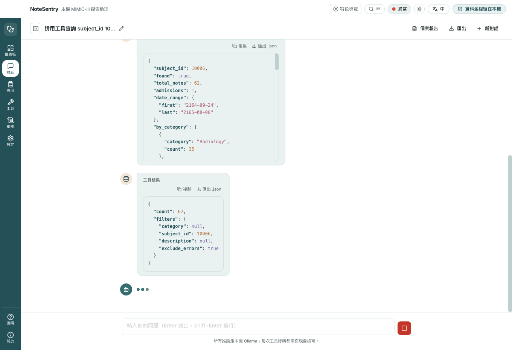
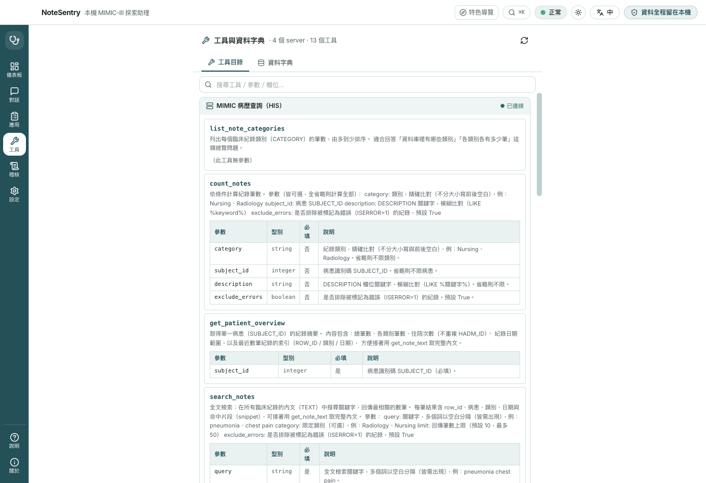
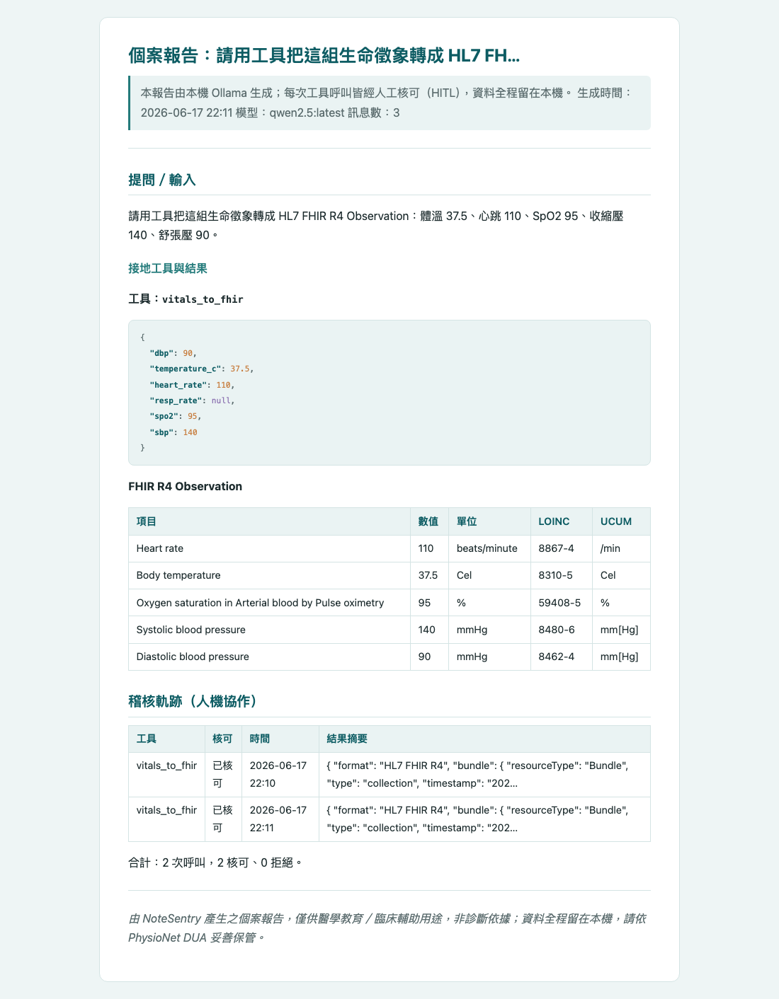
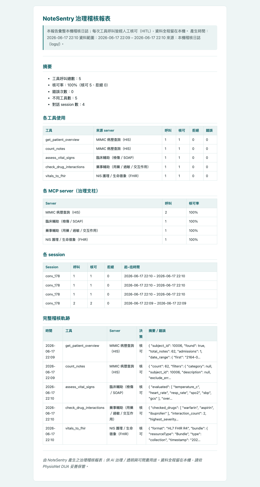

<div align="center">


# NoteSentry

**Local‑first MIMIC‑III clinical‑notes assistant — explore clinical notes with a local LLM, MCP tools, and human‑in‑the‑loop approval. All data and inference stay on‑device.**

[](https://github.com/swiftruru/notesentry-mcp/releases)
[](LICENSE)


**English** · [繁體中文](README.zh-TW.md)

</div>

---

NoteSentry is a desktop assistant for exploring **MIMIC‑III** clinical notes in natural
language. A **local** Ollama LLM queries a **local** SQLite database through MCP tools and
turns the results into an answer.

Beyond free‑form chat it ships **structured clinical apps** (a Triage and a SOAP‑note form),
a **modular multi‑MCP backend** (notes query · clinical support · pharmacy safety · FHIR
vitals), and a **grounding → reasoning → human‑review** pipeline where every tool call is
approved by you. All four MCP servers are bundled; the architecture is additive — a new
server is pure addition and HITL, audit, routing, and the agent loop apply automatically.

> **Data stays on this device.** This data is governed by the PhysioNet Credentialed Data
> Use Agreement (DUA) and may not leave the machine: all inference runs on local Ollama;
> every tool call requires your explicit approval (HITL); nothing is uploaded, no telemetry,
> and all app data (config, logs, conversations) is stored locally on your machine.

## Screenshots

<table>
<tr>
<td width="50%"><br><b>Governance dashboard</b> — live HITL approval rate, tool usage & per‑pillar activity</td>
<td width="50%"><br><b>Human‑in‑the‑loop</b> — every tool call is approved by you (no bypass)</td>
</tr>
<tr>
<td width="50%"><br><b>Grounded chat</b> — answers backed by real on‑device DB queries</td>
<td width="50%"><br><b>Tools & data dictionary</b> — live tool parameters + MIMIC schema</td>
</tr>
<tr>
<td width="50%"><br><b>Case report</b> — deterministic, incl. <b>FHIR R4</b> Observation (LOINC/UCUM)</td>
<td width="50%"><br><b>Governance & audit report</b> — exportable, self‑contained HTML</td>
</tr>
</table>

<sub>Captured from the running app via the bundled Playwright capture harness (`npm run capture`). More in <a href="docs/screenshots-1/system-analysis-specification.md">the system‑analysis document</a>.</sub>

## Download

> 📖 **New here? Follow the [Installation & First‑Run Guide](docs/INSTALL.md)** —
> it walks you from a fresh machine to a working app (Ollama, Python, database, settings).

Prebuilt installers for **macOS / Windows / Linux** are attached to every
[release](https://github.com/swiftruru/notesentry-mcp/releases). The buttons below always
download the **latest** version:

<div align="center">

[](https://github.com/swiftruru/notesentry-mcp/releases/latest/download/NoteSentry-mac-arm64.dmg)
&nbsp;
[](https://github.com/swiftruru/notesentry-mcp/releases/latest/download/NoteSentry-win-setup-x64.exe)
&nbsp;
[](https://github.com/swiftruru/notesentry-mcp/releases/latest/download/NoteSentry-linux-x86_64.AppImage)

<sub>macOS button = Apple Silicon `.dmg` · Windows = installer · Linux = AppImage · other variants below</sub>

</div>

| Platform | Direct download (always latest) |
| --- | --- |
| macOS · Apple Silicon | [`.dmg`](https://github.com/swiftruru/notesentry-mcp/releases/latest/download/NoteSentry-mac-arm64.dmg) · [`.zip`](https://github.com/swiftruru/notesentry-mcp/releases/latest/download/NoteSentry-mac-arm64.zip) |
| macOS · Intel | [`.dmg`](https://github.com/swiftruru/notesentry-mcp/releases/latest/download/NoteSentry-mac-x64.dmg) · [`.zip`](https://github.com/swiftruru/notesentry-mcp/releases/latest/download/NoteSentry-mac-x64.zip) |
| Windows · x64 | [installer `.exe`](https://github.com/swiftruru/notesentry-mcp/releases/latest/download/NoteSentry-win-setup-x64.exe) · [portable `.exe`](https://github.com/swiftruru/notesentry-mcp/releases/latest/download/NoteSentry-win-portable-x64.exe) |
| Linux · x64 | [`.AppImage`](https://github.com/swiftruru/notesentry-mcp/releases/latest/download/NoteSentry-linux-x86_64.AppImage) · [`.deb`](https://github.com/swiftruru/notesentry-mcp/releases/latest/download/NoteSentry-linux-amd64.deb) |

> The app itself ships with the MCP server scripts bundled. You still need
> [Ollama](https://ollama.com) and Python 3 (`pip install "mcp[cli]"`) installed, plus a
> `mimic_notes.db` you build from your own credentialed MIMIC‑III data — see
> [Prerequisites](#prerequisites). On macOS the build is ad‑hoc signed (no paid Apple
> certificate), so on first launch use **right‑click → Open**.

## Chat experience

A Claude‑Chat‑like desktop experience:

- **Multi‑conversation management**: create, switch, rename, search, delete; conversations
  are saved to `conversations/` in the project folder (clinical text never leaves the
  machine) and persist across restarts.
- **Auto‑titling**: after the first exchange, a local Ollama model generates a short title
  (still editable).
- **Live streaming**: token‑by‑token responses; stop generation anytime.
- **Markdown & code**: headings, lists, tables, bold, links render correctly; code blocks
  get syntax highlighting and one‑click copy.
- **Message actions**: copy a whole reply; regenerate the last reply.
- **Markdown export**: save a conversation as `.md` (native Save As — choose any location,
  defaults to Documents and remembers the last folder; includes tool calls and results,
  fully local).
- **Follow‑up suggestions**: clickable next‑question prompts are generated on a new chat,
  after each turn, and when loading an old conversation.
- **Bilingual (i18n)**: one‑click `繁體中文 / English` toggle in the top‑right — the UI,
  the model's answer language, auto‑titles, suggestions, export labels, and error messages
  all switch; the choice is remembered in `config.json`.
- **Activity‑rail layout**: the left icon rail switches `Chat / Apps / Tools / Audit / Settings / About`.

### Adding a language (no component changes)

Translation files live in `src/shared/locales/<lang>/<namespace>.json` (both the renderer and
the main process auto‑load them via `import.meta.glob`). To add a third language (e.g.
Japanese), just add a `src/shared/locales/ja/` folder of JSON files — the top‑right toggle
picks it up automatically, **with no changes to any component code**. Each locale's
`common.json` provides `language.self` / `language.short` for the toggle's display name.

## Productivity & UX

- **System health bar**: a header indicator (Ollama / model / MCP / database / Python) that
  auto‑checks on startup and after saving settings. Click it for per‑item status with actionable
  hints, a re‑check, and a jump to Settings; a startup banner surfaces the top problem so failures
  are never silent.
- **Dark mode**: a header theme toggle (system / light / dark), remembered across launches and
  following the OS in system mode.
- **Command palette (`⌘K` / `Ctrl+K`)**: search every command — new chat, switch views, export,
  reconnect MCP, re‑check health, theme, language — plus a **jump‑to‑conversation** section.
- **Keyboard shortcuts**: `⌘N` new chat · `⌘1–5` switch views · `⌘,` settings · `⌘E` export ·
  `Esc` stops generation / closes the palette.
- **HITL approval dialog**: `Enter` approves, `Esc` rejects, focus is trapped, and tool arguments
  are pretty‑printed.
- **Audit tools**: search + filter (all / approved / rejected / errors), expand a row for the full
  arguments, result summary and session id, and export the log as `.jsonl`.
- **Global toasts** (saved / exported / reconnected / deleted), smart auto‑scroll with a
  "scroll to latest" button, and retry on error bubbles.
- **Window memory & collapsible sidebar**: the window remembers its size/position; the conversation
  list collapses to widen the chat — toggle in the chat header, or click the active **Chat** rail icon.
- **Demo starter prompts**: a new chat offers one‑click sample questions that each exercise a real
  tool (triage vitals, SOAP drafting, data queries, and a deliberately‑missing record).
- **Accessibility**: keyboard‑visible focus on every control, accessible names on icon buttons and
  inputs, `<html lang>` synced to the UI language, a screen‑reader status region for streaming
  (instead of reading every token), a combobox/listbox command palette, keyboard‑operable
  conversation rows, semantic landmarks, WCAG‑AA dark contrast, and `prefers-reduced-motion`.

## Clinical apps

The **Apps** tab turns free‑form chat into four structured, form‑driven workflows — one per
MCP pillar. Each form builds a grounded prompt and runs it through the same agent loop — so
every tool call still asks for your approval, and the result lands in a normal chat thread you
can keep working in.

- **App A · Triage**: enter the chief complaint and vital signs; the LLM calls
  `assess_vital_signs` (rule‑based red‑flag check) and `get_ttas_reference`, then suggests a
  TTAS level with its reasoning. The triage nurse makes the final call.
- **App B · SOAP note**: enter exam keywords and a note type; the LLM expands them into a
  SOAP draft grounded by `get_soap_template`. The physician reviews and signs off.
- **App C · Medication safety**: enter the current medication list and known allergies; the
  LLM calls `check_drug_interactions` and `check_allergy_conflict`, then summarizes the risk
  level and recommendations. The physician and pharmacist confirm.
- **App D · Vital signs → FHIR**: enter vital signs; the LLM calls `vitals_to_fhir` to emit
  HL7 **FHIR R4** `Observation` resources (LOINC codes, UCUM units) — demonstrating
  standards‑based exchange across systems.

**No more blank forms.** Each form has two one‑click ways to populate it:

- **Load sample**: built‑in, realistic presets — instant and demo‑safe. Clicking again
  cycles to the next case.
- **✨ AI‑generate sample**: the **local** Ollama model generates a random synthetic case as
  JSON and fills the form (~6–15 s). If generation fails it automatically falls back to a
  built‑in preset (with a toast), so a live demo never stalls.

> Samples are synthetic (no PHI) and only *fill the fields* — nothing is submitted until you
> press the form's action button, and each resulting tool call is still individually approved.

## Architecture

- **Main process** (`src/main`): holds every "touches data / network" capability — launching
  and monitoring the Python MCP subprocesses, listing/calling MCP tools, calling local Ollama
  (streaming), running the agent loop, HITL approval, writing the audit log, reading/writing
  settings.
- **Preload** (`src/preload`): exposes a whitelisted `window.api` via `contextBridge`.
- **Renderer** (`src/renderer`): pure React / Tailwind UI with `contextIsolation` on,
  `nodeIntegration` off, `sandbox` on; talks to main only through `window.api`.

Data flow: `Composer → chat:send → agentLoop → Ollama stream`; if the model returns
`tool_calls`, `approvalBroker` raises an approval request → the renderer shows
`ApprovalDialog` → only after you approve does `mcpClient.callTool` run → the result is fed
back → the loop continues until the final answer. Every tool call (including rejections) is
written to the audit log.

## Prerequisites

1. **Ollama**: `ollama serve` running, with a tool‑calling model ready (recommended
   `gpt-oss:20b`; or `ollama pull qwen2.5`. See "Model recommendation" below).
2. **Python + MCP**: `python3` with the MCP package:

   ```bash
   pip install "mcp[cli]"
   ```

3. **Build the database**: use the bundled `mcp/scripts/build_db.py` to import `NOTEEVENTS.csv` into
   SQLite (standard library only — handles multi‑GB files, no pandas needed).

   ```bash
   # Full import (~2M rows; a few minutes depending on machine)
   python3 mcp/scripts/build_db.py --csv MIMIC-III/dataset/NOTEEVENTS.csv --db mimic_notes.db

   # Import and build the full-text index (for search_notes; a few extra minutes)
   python3 mcp/scripts/build_db.py --csv MIMIC-III/dataset/NOTEEVENTS.csv --db mimic_notes.db --with-fts

   # Or add the full-text index to an existing database (no re-import)
   python3 mcp/scripts/build_db.py --db mimic_notes.db --fts-only

   # Quick test with a small slice (first 20k rows)
   python3 mcp/scripts/build_db.py --db mimic_notes_test.db --limit 20000 --rebuild
   ```

> The project bundles **four** MCP servers (FastMCP / stdio) and `mcp/scripts/build_db.py`. The app
> connects to all of them at once (a multi‑MCP architecture) and routes each tool to the
> right server by name. Only `mcp/servers/mimic_mcp_server.py` needs the database; the other three are
> self‑contained knowledge/rule servers that work out of the box.

### MCP servers & tools (four servers, all read‑only / side‑effect‑free)

**`mcp/servers/mimic_mcp_server.py` — MIMIC notes query** (needs `mimic_notes.db`)

| Tool | Purpose |
| --- | --- |
| `list_note_categories` | Per‑category (CATEGORY) note counts |
| `count_notes` | Count by category / patient / DESCRIPTION keyword |
| `get_patient_overview` | Record summary for one patient (SUBJECT_ID) |
| `search_notes` | **Full‑text search** of note text (TEXT), returns matched snippets (needs the FTS index) |
| `get_note_text` | Full text of a single note by ROW_ID |

**`mcp/servers/clinical_support_mcp_server.py` — clinical support** (no database needed)

| Tool | Purpose | App |
| --- | --- | --- |
| `assess_vital_signs` | Rule‑based vital‑sign assessment with red‑flag alerts (zero hallucination, reproducible) | A · triage |
| `get_ttas_reference` | TTAS 5‑level triage criteria + chief‑complaint red flags (built‑in knowledge) | A · triage |
| `get_soap_template` | SOAP note structure and section‑by‑section guidance | B · charting |

**`mcp/servers/pharmacy_support_mcp_server.py` — pharmacy safety** (no database needed)

| Tool | Purpose |
| --- | --- |
| `check_drug_interactions` | Pairwise interaction check over a drug list, with severity (major / moderate / minor) and rationale |
| `check_allergy_conflict` | Cross‑checks prescribed drugs against the patient's allergies, including drug‑class matches (e.g. penicillin → amoxicillin) |
| `get_drug_reference` | Built‑in reference for a drug (class, common cautions) |

**`mcp/servers/nis_fhir_mcp_server.py` — nursing / vitals as FHIR** (no database needed)

| Tool | Purpose |
| --- | --- |
| `vitals_to_fhir` | Converts vital signs into a **FHIR R4** Bundle of `Observation` resources (LOINC codes, UCUM units) |
| `get_fhir_reference` | Field mapping for common FHIR resources (Patient / Observation / AllergyIntolerance / MedicationStatement) |

> Design principle: triage levels and SOAP drafting are produced by **LLM reasoning**; these
> tools only *ground* that reasoning in deterministic references (rule‑based vitals, the
> official triage scale, a fixed format) — the final decision is always reviewed by a
> clinician. This is the "MCP grounding → LLM reasoning → human review" three‑layer defense.

### MCP server integration contract

The app launches an MCP server as:

```text
<pythonPath> <mcpScriptPath>     # e.g. python3 ./mcp/servers/mimic_mcp_server.py
```

and passes the absolute SQLite path via the **`MIMIC_DB_PATH`** environment variable. Make
sure `mcp/servers/mimic_mcp_server.py` reads it to locate the database, e.g.:

```python
import os
DB_PATH = os.environ.get("MIMIC_DB_PATH", "mimic_notes.db")
```

If your server obtains the DB path another way (hard‑coded or CLI argument), align it to read
`MIMIC_DB_PATH`, or point the script path in Settings at a launcher that already embeds the
correct path.

## Develop & run

```bash
npm install
npm run dev          # development (HMR)
npm run build        # produce out/
npm start            # preview the built app
npm run typecheck
npm run package      # build a distributable app (electron-builder)
```

> Note: if your shell sets `ELECTRON_RUN_AS_NODE=1` (some Electron‑based tools do), Electron
> runs as plain Node instead of a GUI. Run in a clean terminal, or use
> `env -u ELECTRON_RUN_AS_NODE npm start`.

## App icon & name (macOS)

- The icon lives at `build/icon.png` (packaging) and `resources/icon.png` (runtime);
  electron-builder generates the `.icns` when packaging.
- On macOS in `npm run dev`, the Dock name, the bold menu‑bar title, and the About panel icon
  are read from the running `Electron.app` bundle — `app.setName()` cannot change them. This
  project uses [scripts/patch-dev-name.mjs](scripts/patch-dev-name.mjs) to automatically patch
  the Electron bundle's `CFBundleName` and icon to NoteSentry before each `npm run dev` (via
  `predev`), so the name and icon are correct in dev too. If macOS caches the old values, fully
  quit Electron and run `npm run dev` again.
- The packaged `.app` uses `productName` / `build.icon`, so its name and icon are always correct.

## Settings

Settings are stored in `config.json` at the project root (created on first launch) and can
also be edited in the app's "Settings" tab:

| Field | Default | Notes |
| --- | --- | --- |
| `ollamaUrl` | `http://localhost:11434` | Local addresses only (hard guard) |
| `model` | `gpt-oss:20b` | Must support tool calling (see below) |
| `pythonPath` | `python3` | Python used to launch all MCP servers |
| `dbPath` | `./mimic_notes.db` | SQLite path, passed to each server via `MIMIC_DB_PATH` |
| `language` | `zh-TW` | UI and model‑answer language (also via the top‑right toggle) |
| `mcpServers[]` | mimic + clinical + pharmacy + nis | Multiple MCP servers (id / name / scriptPath / enabled); missing defaults are auto‑merged into an existing `config.json` on launch |

### Model recommendation (tool‑call reliability)

Whether HITL reliably triggers depends on whether the model emits a *structured* tool call
rather than describing one in prose. Measured (same question, same hardened prompt):

- **`gpt-oss:20b` (recommended, default)**: native function calling, reliably emits structured
  tool calls, and fastest (~25s to the first tool call). Already installed, no download.
- **`qwen2.5`**: lightweight (7B), reliable tool calling, good for lower‑end machines
  (`ollama pull qwen2.5`).
- **`qwen3.6:27b`**: works, but reasoning‑oriented and slower; occasionally writes the tool
  call as prose (then HITL won't trigger).

> The agent loop uses `temperature: 0.3` and injects the available tool list into the system
> prompt (forbidding invented tables and prose tool calls), which greatly reduces fabrication
> and missed HITL prompts (see [agentLoop.ts](src/main/agent/agentLoop.ts)).

## Audit log

Every tool call (time, tool name, parameters, approved/rejected, result summary/error) is:

- shown live in the "Audit" tab;
- appended to `logs/audit-YYYY-MM-DD.jsonl` (one entry per line, never leaves the project folder).

## Security

- Connects only to local Ollama; an `ollamaUrl` that isn't localhost / 127.0.0.1 is blocked.
- The renderer CSP allows only `'self'` and local Ollama; external links and navigation are disabled.
- Every tool call requires human approval — there is no "allow all" bypass.
- `config.json`, `logs/`, `conversations/`, `exports/`, the database, and the MIMIC dataset are
  all in `.gitignore`; files containing clinical text are never committed.

## Tech stack

Electron · React · TypeScript · Tailwind CSS · zustand · react-i18next ·
Model Context Protocol (`@modelcontextprotocol/sdk`) · Ollama · SQLite (FTS5) · FastMCP (Python) ·
FHIR R4 (LOINC / UCUM)

## License & acknowledgments

- Author: YU‑RU, PAN (潘昱如) · Data Decision Analysis Laboratory ·
  Department of Information Management, National Taipei University of Nursing and Health Sciences
- Data source: MIMIC‑III Clinical Database (PhysioNet). Use of this data is subject to the
  PhysioNet Credentialed Data Use Agreement (DUA); the dataset and any derived files containing
  clinical text must not be shared or committed.
- License: MIT (code).
