# NoteSentry 系統分析與規格文件

> **急診 LLM 輔助系統 — 以 MCP 架構整合人機協作**
> 本機端 MIMIC‑III 臨床紀錄探索助理：以**本機 LLM（Ollama）**＋**多 MCP 工具**＋**人機協作（HITL）**探索臨床紀錄；
> **資料與推論全程留在本機**。
> 版本：v0.3.7　｜　平台：Electron 桌面應用（macOS / Windows / Linux）　｜　語言：繁體中文／English（可即時切換）

本文件依系統實機操作撰寫，所有畫面均為**真實截圖**（非示意圖），可直接作為後續簡報製作依據。

---

## 0. 文件導讀與重點摘要

NoteSentry 是一套**桌面型、本機優先**的臨床紀錄探索助理，對應醫療資訊系統課程的兩大任務：

- **任務三（系統整合）**：以「多 MCP（Model Context Protocol）」架構整合四大支柱 **HIS／NIS／LIS／藥事**，
  並以 **HL7 FHIR R4 Observation（含 LOINC 代碼、UCUM 單位、Bundle）**示範跨系統標準對接。
- **任務四（AI 治理）**：每一次工具呼叫都需**人工核可（HITL）**，所有行為寫入**稽核軌跡**，並能匯出
  **治理稽核報表**；全程本機、零外流、可問責、可驗證。

**核心設計理念——三層防線：** `MCP 接地（確定性工具）→ LLM 推理（本機 Ollama）→ 人類覆核（HITL）`。
LLM 的判斷一律「接地」到確定性的工具結果，並由人類覆核每一個動作，避免幻覺與不可控的自動執行。

### 亮點一覽（適合簡報首頁）

| 面向 | 亮點 |
| --- | --- |
| 系統整合（任務三） | 4 支 MCP server／**13 個工具**、四支柱路由、FHIR R4 Observation（LOINC/UCUM/Bundle）標準輸出 |
| AI 治理（任務四） | **每次工具呼叫 100% HITL 核可**、完整稽核軌跡（畫面＋JSONL）、一鍵**治理稽核報表** |
| 隱私合規 | 本機 Ollama 推論、localhost‑only 防護、符合 PhysioNet **DUA**、無上傳/無遙測 |
| 臨床應用 | 四個結構化應用：**檢傷**、**SOAP 病歷**、**用藥安全**、**生命徵象→FHIR** |
| 可交付產物 | **個案報告**（含 FHIR 表）與**治理稽核報表**（HTML／Markdown，自包含、可列印） |
| 工程品質 | 全自動 UI 測試（離線 51 項＋@live＋視覺回歸）、無障礙稽核（axe 入 CI）、雙語完整性測試、CI/CD 三平台發版 |

### 截圖索引

| 圖號 | 標題 | 對應分頁／功能 |
| --- | --- | --- |
| 圖 1 | 治理總覽儀表板 | 儀表板（任務四） |
| 圖 2 | 系統健康狀態 | 標題列健康監測 |
| 圖 3 | 對話空狀態與起手範例 | 對話 |
| 圖 4 | 對話：工具呼叫的真實查詢結果 | 對話（任務三接地） |
| 圖 5 | 人類覆核（HITL）核可對話框 | 對話（任務四核心） |
| 圖 6–9 | 四個結構化臨床應用表單 | 應用 |
| 圖 10 | 生命徵象 → FHIR 轉換結果 | 應用 D（任務三 FHIR） |
| 圖 11 | 工具目錄（參數明細） | 工具與資料字典 |
| 圖 12 | MIMIC 資料字典 | 工具與資料字典（任務三） |
| 圖 13–14 | 稽核日誌與展開明細 | 稽核（任務四） |
| 圖 15–18 | 設定五分頁 | 設定 |
| 圖 19 | 命令面板（⌘K） | 橫向功能 |
| 圖 20 | 特色導覽 | 橫向功能 |
| 圖 21 | 系統架構（說明頁） | 說明 |
| 圖 22 | 關於頁 | 關於 |
| 圖 23 | 治理稽核報表（HTML） | 治理報表（任務四） |
| 圖 24 | 個案報告（含 FHIR 表，HTML） | 個案報告（任務三＋四） |
| 圖 25 | 英文介面（i18n） | 多語 |

---

## 1. 系統概述

### 1.1 開發背景與核心目標

醫療場域導入 LLM 的兩大顧慮是**資料外流**與**不可控的自動行為**。NoteSentry 以一個可實際操作的桌面系統回應這兩點：
用**本機 Ollama** 對 **MIMIC‑III** 臨床紀錄做自然語言探索，所有查詢都透過 **MCP 工具**接地到本機 SQLite 資料庫，
再把結果交給 LLM 整理成答案；而**每一個工具呼叫都必須由使用者親自核可**，並留下完整稽核。

核心目標：**在不犧牲隱私與可問責的前提下，示範「LLM × 臨床資訊系統整合 × 人機協作治理」的完整可行流程。**


> **圖 1**　系統首頁＝「治理總覽」儀表板，即時呈現工具呼叫總數、核可率、各 MCP 支柱活動與近期工具呼叫。
> 對應**任務四**「以可視化呈現 AI 治理事實」。

### 1.2 對應的作業任務

- **任務三 系統整合**：四支柱（HIS 病歷／NIS 護理生命徵象／LIS 檢驗／藥事）以多 MCP 架構整合；
  並以 **FHIR R4** 標準資源（Observation）示範院內系統互通。
- **任務四 AI 治理**：HITL 核可、稽核軌跡、治理報表、本機零外流、透明（系統提示與工具/參數字典可檢視）。

### 1.3 硬性限制（系統設計上的保證）

1. **本機優先**：只連本機 Ollama；`ollamaUrl` 非 `localhost／127.0.0.1` 會被阻擋。
2. **每次工具呼叫皆需 HITL 核可**，沒有「全部允許」的旁路。
3. **符合 PhysioNet DUA**：對話、資料庫、稽核、匯出皆存於本機，且 `.gitignore` 排除，不進版控、不外流、不遙測。

---

## 2. 系統整體架構

### 2.1 技術棧

| 層 | 技術 |
| --- | --- |
| 桌面殼層／前端 | Electron 33、React 19、TypeScript、Tailwind CSS、zustand、react‑i18next |
| 本機推論 | Ollama（本機 LLM，支援 tool calling；預設 gpt‑oss:20b，可改 qwen2.5 等） |
| 工具後端 | 4 支 **FastMCP / stdio** server（Python），透過 MCP 標準協定連接 |
| 資料 | 本機 SQLite（`mimic_notes.db`，由 `mcp/scripts/build_db.py` 匯入 NOTEEVENTS） |
| 標準對接 | HL7 **FHIR R4**（Observation／Bundle、LOINC、UCUM） |

### 2.2 四支柱 × 多 MCP

| 支柱 | MCP server | 主要工具 | 是否需 DB |
| --- | --- | --- | --- |
| **HIS**（病歷查詢） | `mimic` | `list_note_categories`、`count_notes`、`get_patient_overview`、`search_notes`、`get_note_text` | ✅ |
| **NIS**（臨床輔助：檢傷／SOAP） | `clinical` | `assess_vital_signs`、`get_ttas_reference`、`get_soap_template` | ❌ |
| **藥事**（用藥安全） | `pharmacy` | `check_drug_interactions`、`check_allergy_conflict`、`get_drug_reference` | ❌ |
| **NIS／標準對接**（FHIR） | `nis` | `vitals_to_fhir`、`get_fhir_reference` | ❌ |

> 架構為**加法式**：新增一支 server 只是純粹的「加入」，HITL、稽核、路由、agent 迴圈會自動套用。

### 2.3 三層防線與端到端資料流

`四支柱工具（接地）` → `MCP 路由` → `本機 Ollama Agent（推理）` → `人類覆核 HITL` → `稽核日誌` → `儀表板／報表`

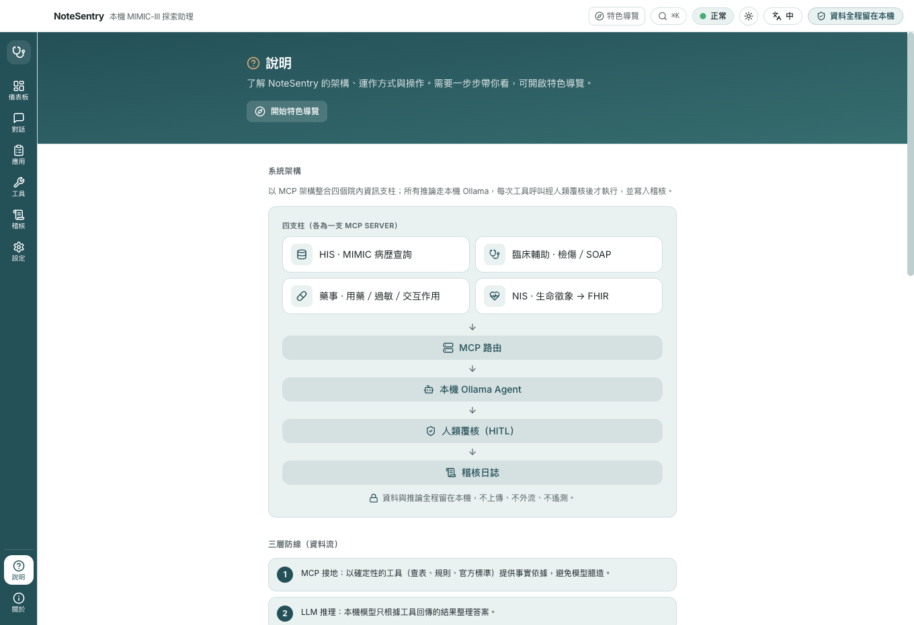

> **圖 21**　系統內建「說明」頁完整呈現架構與三層防線，並標注「資料推論全程留在本機，不上傳、不外流、不遙測」。

---

## 3. 整體操作流程（典型使用情境）

1. 開啟 app → 標題列**健康監測**自動檢查 Ollama／模型／MCP／資料庫／Python（圖 2）。
2. 使用者在**對話**頁提問，或在**應用**頁填寫結構化表單送出。
3. 本機 Ollama 判斷需要資料時，**請求呼叫某個 MCP 工具** → 跳出 **HITL 核可對話框**（圖 5）。
4. 使用者核可後，工具在本機執行、回傳**確定性結果**（圖 4），LLM 據此整理答案。
5. 每次呼叫即時寫入**稽核日誌**（圖 13），**儀表板**同步更新治理指標（圖 1）。
6. 需要交付時，一鍵匯出**個案報告**（圖 24）或**治理稽核報表**（圖 23）。

---

## 4. 各分頁與功能模組逐一說明

> 以下每節皆涵蓋：①模組名稱 ②設計目的與情境 ③主要功能 ④操作流程 ⑤可輸入/設定 ⑥資料處理 ⑦輸出結果 ⑧模組關聯 ⑨對應作業要求 ⑩問題與價值。

### 4.1 儀表板（治理總覽）

- **設計目的與情境**：把「AI 治理」從抽象口號變成**可視化事實**。任何人打開系統即看到目前的人機協作治理狀態。
- **主要功能**：系統健康列、5 項治理 KPI、工具使用排行、各 MCP 支柱活動、近期工具呼叫、一鍵匯出治理報表、快捷入口。
- **操作流程**：開啟即進入 → 可點「重新檢查」更新健康 → 點卡片快速跳到對話／應用／稽核／設定 → 點右上「匯出治理報表」。
- **可輸入/設定**：無需輸入（純彙整）；可點選快捷入口與匯出。
- **資料處理**：以 `useMemo` 即時從稽核資料（store.audit）推導指標——
  總呼叫數、核可數、核可率%、拒絕、錯誤、不同 session 數；工具→server 對映出各支柱次數。
- **輸出結果**：
  - **系統健康**：本機 Ollama／MCP 連線（4/4）／資料庫／Python 四個狀態燈。
  - **KPI**：工具呼叫總數、**核可率（100%）**、已拒絕、錯誤、對話數。
  - **長條圖**：工具使用次數（前 8）、各 MCP 支柱活動。
  - **近期工具呼叫**清單（含核可狀態）。
- **模組關聯**：完全由「對話／應用 → HITL → 稽核」產生的資料驅動；是治理資料的**彙整中樞**。
- **對應作業要求**：**任務四**——以可視化呈現「每次工具呼叫都經人工核可」的治理成效。
- **問題與價值**：讓稽核資料「看得懂、用得上」，可直接作為治理成效的佐證。

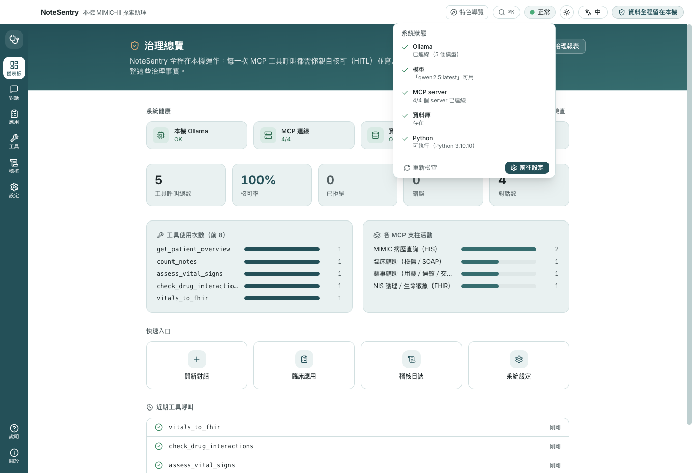

> **圖 2**　標題列「健康狀態」下拉，逐項顯示本機 Ollama、模型、MCP 連線數、資料庫與 Python 的即時狀態。

### 4.2 對話（Chat：串流 ＋ 工具呼叫 ＋ HITL）

- **設計目的與情境**：以自然語言探索 MIMIC‑III 病歷；是「接地→推理→覆核」最直接的體現。
- **主要功能**：多對話管理（新增/切換/改名/搜尋/刪除）、即時串流回覆、工具呼叫與結果呈現、**HITL 核可**、
  自動標題、後續問題建議、Markdown 匯出、個案報告匯出。
- **操作流程**：輸入問題（Enter 送出）→ 模型請求工具 → **HITL 對話框**核可/拒絕 → 工具回傳結果 → 模型彙整答案。
- **可輸入/設定**：對話輸入框（多行，Shift+Enter 換行）；可改對話標題；起手範例一鍵送出。
- **資料處理**：`send()` 將訊息送到 agent 迴圈；以事件串流 token；遇工具呼叫送出 `EVT_HITL_REQUEST`，
  核可後在本機執行工具、回傳結果，並寫入稽核。
- **輸出結果**：使用者泡泡、助理泡泡（Markdown）、**工具呼叫塊**（工具名＋參數 JSON）、**工具結果塊**
  （JSON 語法高亮、可複製/匯出 .json）。
- **模組關聯**：與**應用**（表單送出後導流到此）、**HITL**、**稽核**、**個案報告**緊密串聯。
- **對應作業要求**：**任務三**（HIS 病歷查詢接地）＋**任務四**（每次工具呼叫 HITL）。
- **問題與價值**：用自然語言就能查病歷，同時確保「資料只在本機查、每步都經人核可」。

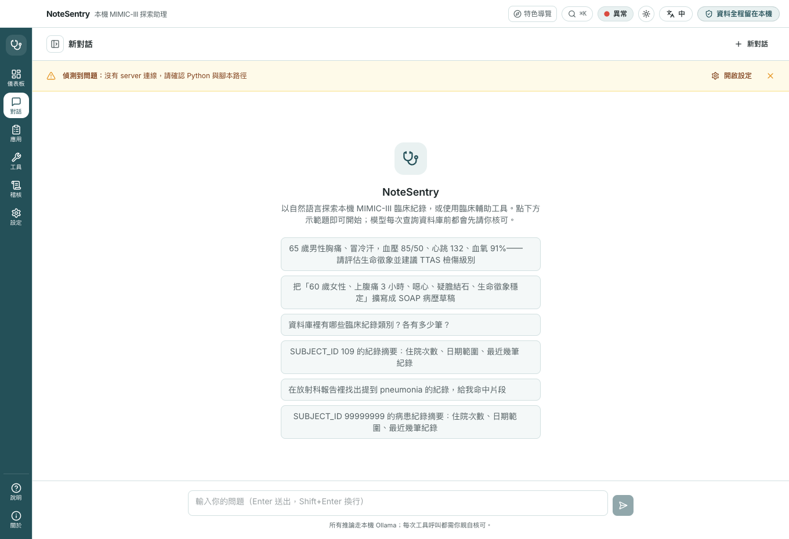

> **圖 3**　空對話顯示應用簡介與 6 個「會實際呼叫工具」的起手範例，降低使用門檻。


> **圖 4**　助理請求 `get_patient_overview` 與 `count_notes` 後，回傳**真實 DB 查詢結果**（subject_id 10006、total_notes 62、
> 依類別 Radiology 35…）。這就是「接地（grounding）」——答案有來源、可驗證。對應**任務三**。


> **圖 5**　**任務四核心畫面**。模型要求查詢本機資料庫時，必須先經此對話框核可：顯示工具 `get_patient_overview`、
> 來源「MIMIC 病歷查詢（HIS）」、參數 `subject_id=10006`，並可用 Enter 核可／Esc 拒絕。**沒有「全部允許」旁路。**

### 4.3 應用（結構化臨床應用 A–D）

- **設計目的與情境**：把常見急診情境做成**結構化表單**，降低自由問答門檻，並對應四支柱。
- **四個應用**：
  - **A 檢傷**：輸入主訴＋生命徵象 → 觸發 `assess_vital_signs`（規則判讀紅旗）＋`get_ttas_reference`（TTAS 檢傷分級參考）。
  - **B SOAP 病歷**：選病歷類型＋關鍵字 → 觸發 `get_soap_template`，由 LLM 依固定格式擴寫。
  - **C 用藥安全**：輸入藥物清單與過敏史 → 觸發 `check_drug_interactions`、`check_allergy_conflict`。
  - **D 生命徵象→FHIR**：輸入生命徵象 → 觸發 `vitals_to_fhir`，輸出 **FHIR R4 Observation Bundle**。
- **操作流程**：選分頁 → 可「載入範例」或「**AI 生成範例**」（本機 Ollama 生成合成案例，失敗自動回退預設）→ 送出 → 結果導流到**對話**頁（同樣經 HITL）。
- **可輸入/設定**：各表單欄位（主訴、年齡、體溫、心跳、呼吸、SpO₂、血壓、GCS、藥物、過敏、subject_id…）。
- **資料處理**：表單值組成提示詞 → `runApp()` 開新對話並送出 → 進入與對話相同的工具呼叫流程。
- **輸出結果**：在對話頁呈現工具結果與 LLM 整理；應用 D 產出標準 FHIR 資源（圖 10）。
- **模組關聯**：四應用對映四支柱工具；輸出統一回到對話／稽核。
- **對應作業要求**：**任務三**（四支柱整合、FHIR 標準對接）＋**任務四**（每次仍 HITL）。
- **問題與價值**：把「規則判讀、檢傷分級、用藥安全、標準格式輸出」這些**確定性**工作交給工具，LLM 只負責語言整理，
  降低臨床風險（三層防線的實作）。

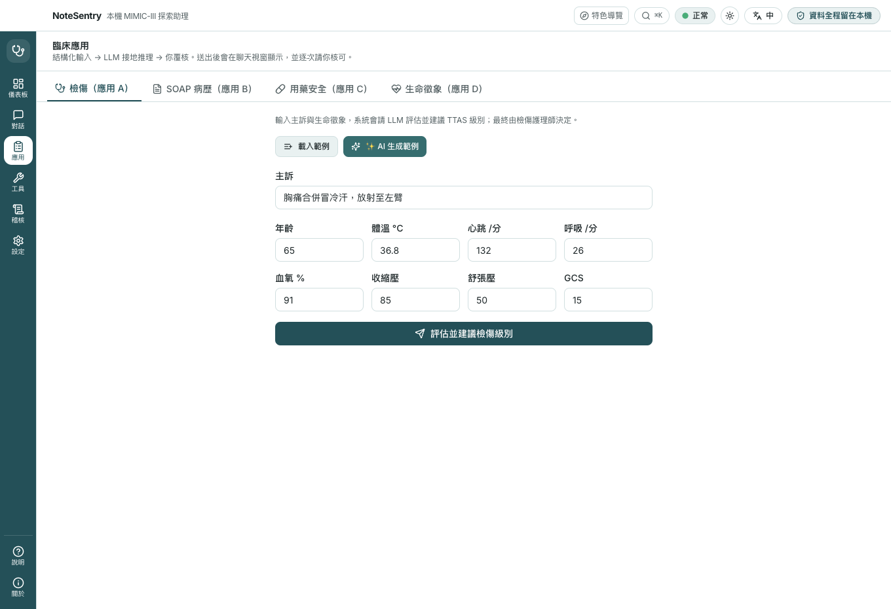
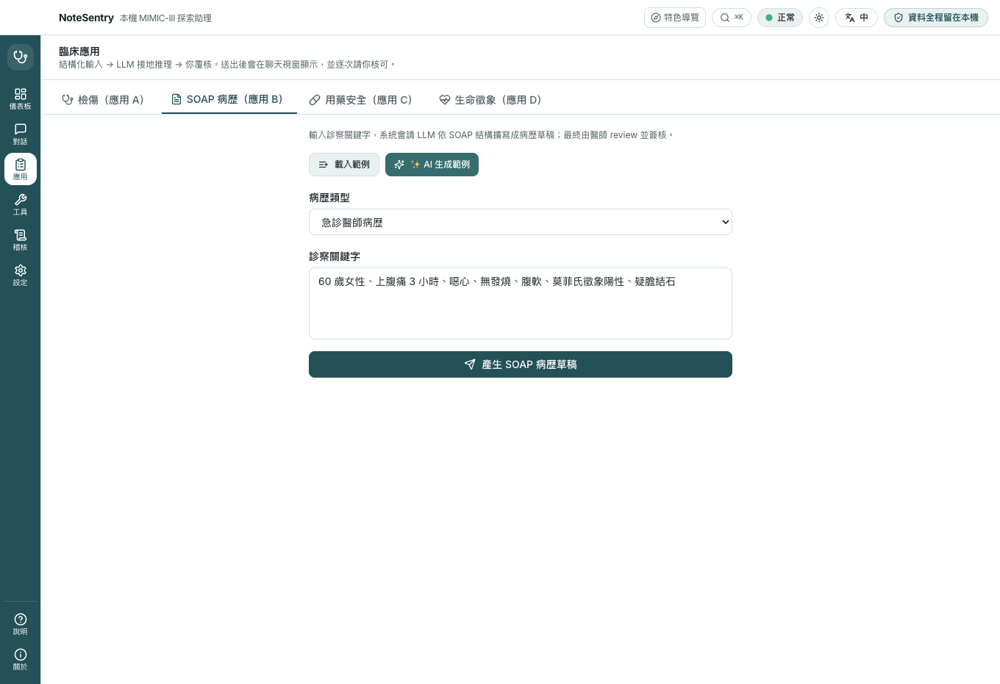
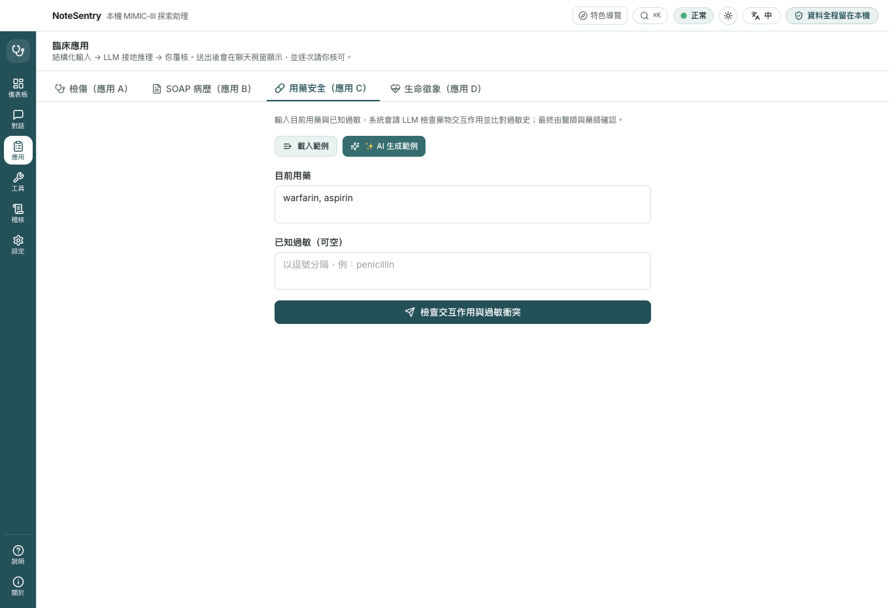
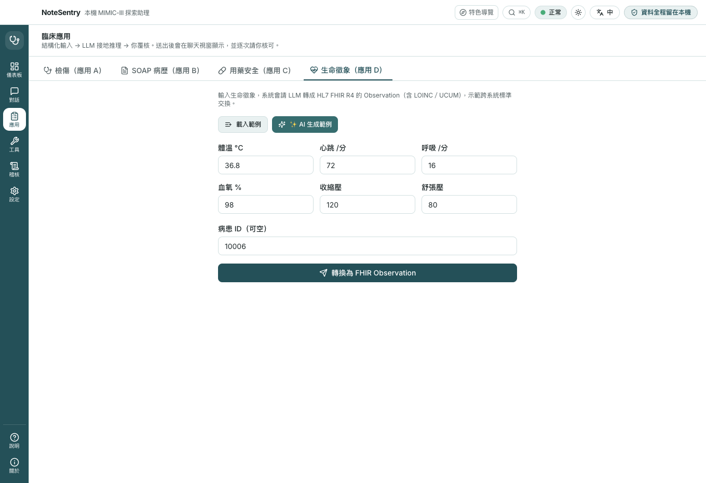

> **圖 6–9**　四個結構化應用表單（皆支援「載入範例／AI 生成範例」一鍵填入，方便展示）。

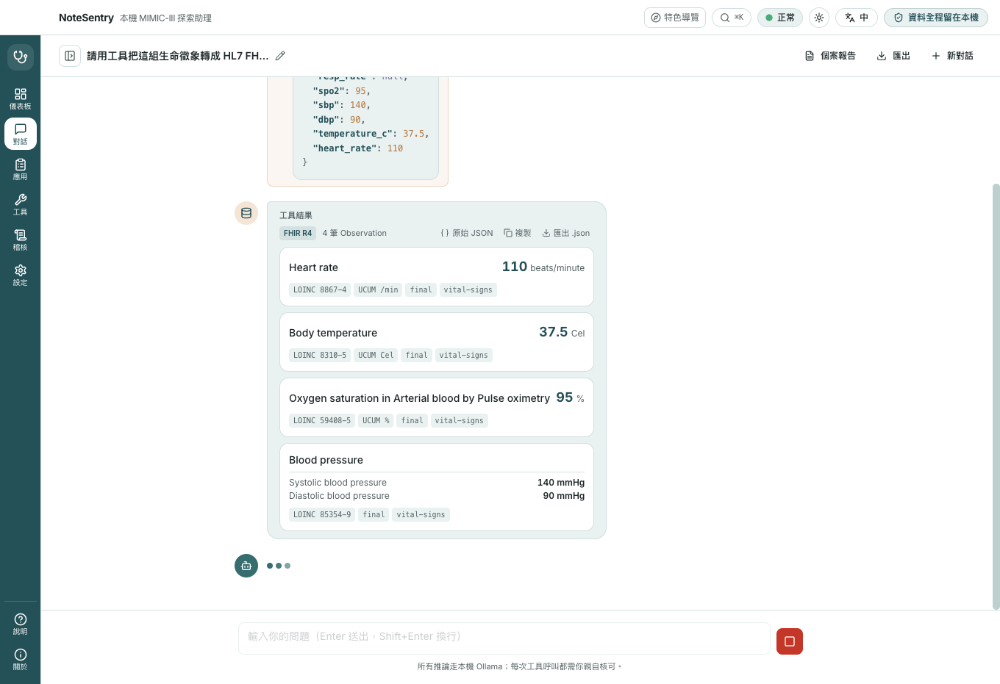

> **圖 10**　應用 D 呼叫 `vitals_to_fhir` 後，產出標準 **FHIR R4 Observation Bundle**（含 LOINC 代碼與 UCUM 單位）。
> 直接對應**任務三「標準化跨系統資料交換」**。

### 4.4 工具與資料字典

- **設計目的與情境**：讓使用者**透明地**知道「系統能呼叫哪些工具、需要什麼參數、底層有哪些資料」。
- **主要功能**：兩分頁——**工具目錄**（依 server 分組、含參數明細表）與**資料字典**（MIMIC `notes` 資料表欄位）；
  共用搜尋；右上可重新連線、顯示各 server 連線狀態（4 server·13 工具）。
- **操作流程**：切換分頁、輸入關鍵字過濾、查看每個工具的參數（參數／型別／必填／說明）。
- **資料處理**：工具目錄直接讀取 live MCP 的 `inputSchema`（永遠與實際一致）；資料字典為公開 schema（非病患資料）。
- **輸出結果**：每個工具的完整參數文件；MIMIC notes 11 個欄位（SUBJECT_ID、CATEGORY、TEXT…）的型別與說明。
- **模組關聯**：是對話/應用所呼叫工具的「說明書」；支撐**透明性**。
- **對應作業要求**：**任務三**（系統整合的可發現性）＋**任務四**（透明、可問責）。
- **問題與價值**：降低「黑箱」疑慮——使用者能自行查證系統的能力邊界與資料來源。


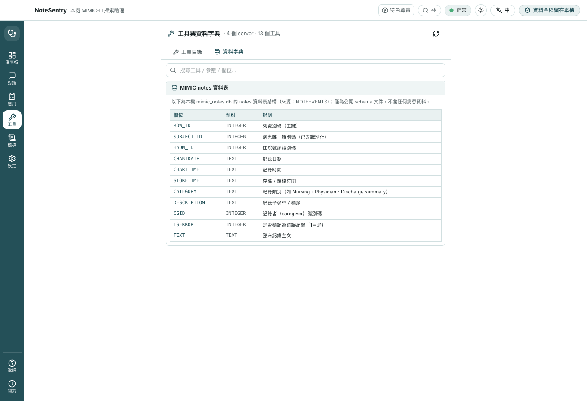

> **圖 11–12**　工具目錄取自 live `inputSchema`，與實際工具完全一致；資料字典僅呈現公開欄位定義，符合 DUA。

### 4.5 稽核日誌

- **設計目的與情境**：作為**可問責**的單一事實來源——每一次工具呼叫的完整紀錄。
- **主要功能**：列表（時間/工具/決策）、篩選（全部/已核可/已拒絕/錯誤）、搜尋、展開明細、匯出 JSONL、匯出治理報表。
- **操作流程**：瀏覽 → 篩選/搜尋 → 點列展開看完整參數與結果 → 視需要匯出。
- **資料處理**：每筆工具呼叫即時寫入記憶體環形緩衝並追加到 `logs/audit-YYYY-MM-DD.jsonl`（每行一筆，永不離開本機）。
- **輸出結果**：每列含時間、工具、核可/拒絕徽章；展開後顯示**完整參數**、**結果摘要**、錯誤、session 與完整時間戳。
- **模組關聯**：資料源頭是 HITL 後的工具執行；向上供應**儀表板**與**治理報表**。
- **對應作業要求**：**任務四**（透明、可問責、可稽核）。
- **問題與價值**：把「誰、在何時、用什麼參數、做了什麼、結果如何」完整留存，可審計、可重現、可交付。

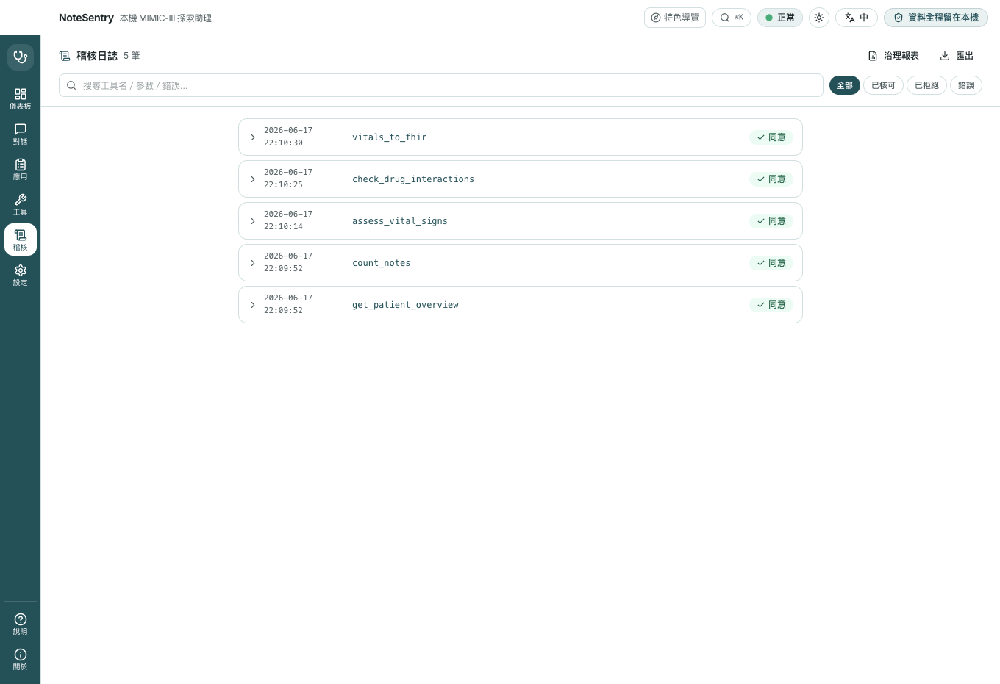
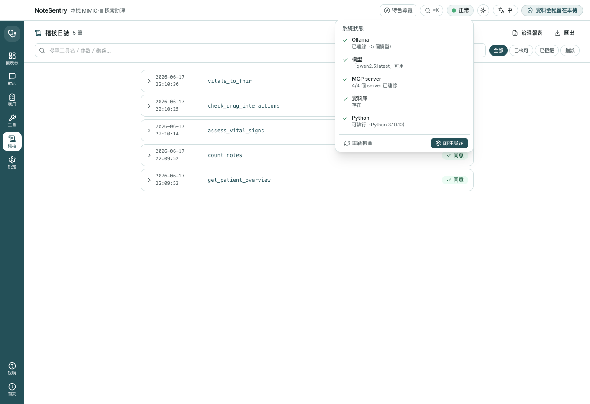

> **圖 13–14**　稽核同時呈現於畫面並落地為 JSONL；展開即見完整參數與結果摘要，符合**任務四**可問責要求。

### 4.6 設定（五分頁）

- **設計目的與情境**：把「本機推論、執行環境、多 MCP、AI 行為、外觀無障礙」分門別類，易於設定與維護。
- **五分頁**：
  - **本機推論**：Ollama 網址（非本機會警告/阻擋）、模型選擇（自動偵測本機已安裝模型）。
  - **執行環境**：Python 路徑、SQLite 資料庫路徑。
  - **MCP server**：4 支 server 的啟用/名稱/腳本路徑、連線狀態、**標準 mcpServers JSON 匯入**、新增自訂 server。
  - **AI 行為**：取樣溫度（0–1，預設 0.3）、最大工具回合數（1–20，預設 12）、**系統提示唯讀預覽**（透明）。
  - **外觀**：字級（小/中/大/特大）＋高對比模式（無障礙）。
- **操作流程**：切分頁設定 → 「連線測試」逐項檢查 Ollama/DB/Python/各 server → 「儲存並重新連線」套用。
- **資料處理**：設定存於專案資料夾 `config.json`；儲存後重連所有 MCP；外觀/語言/主題即時生效。
- **輸出結果**：連線測試結果列（每項 OK/錯誤）；MCP 握手資訊（server 名/版本/能力/schema 驗證）。
- **模組關聯**：決定其餘所有模組的執行條件（模型、工具、資料庫）。
- **對應作業要求**：**任務三**（系統整合的可組態性、標準 MCP 啟動格式）＋**任務四**（系統提示可檢視＝透明）。
- **問題與價值**：把整合所需的設定收斂、可測試，並讓「送進模型的系統提示」對使用者透明。

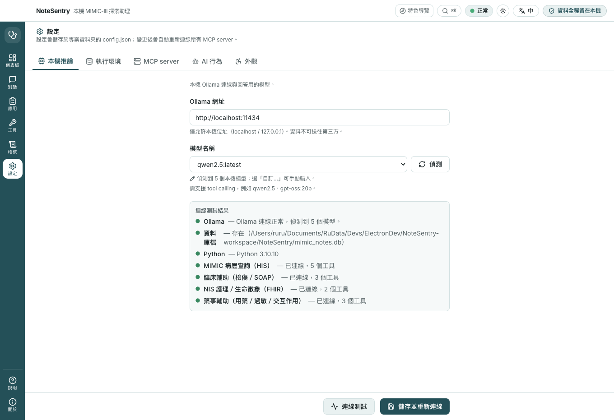
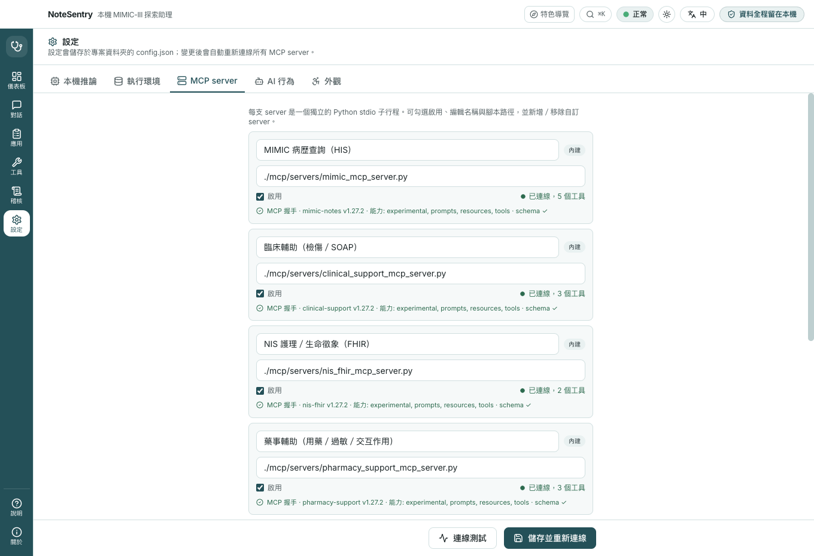
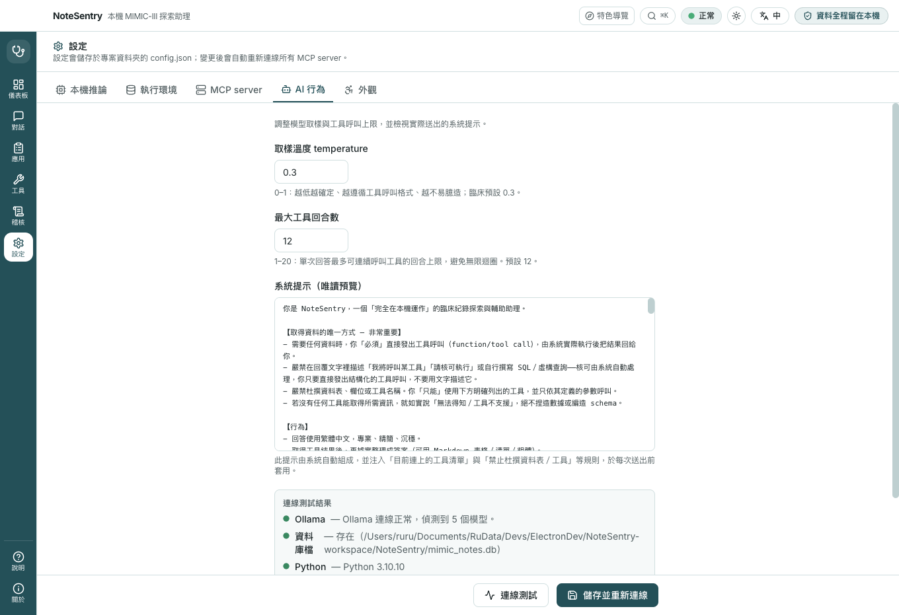
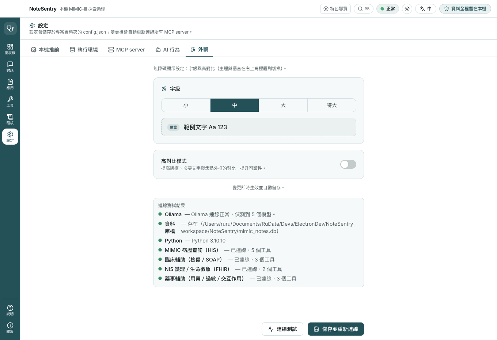

> **圖 15–18**　設定五分頁。圖 17 的「系統提示預覽」讓送進模型的指令完全透明（任務四）；圖 16 採**標準 MCP 啟動格式**，與 Claude Desktop／mcp.json 同義（任務三）。

### 4.7 治理稽核報表匯出

- **設計目的與情境**：把整份稽核日誌**確定性地**彙整成可交付、可存查的治理報告（不呼叫 LLM、不會幻覺）。
- **操作流程**：稽核頁／命令面板／儀表板任一處點「治理報表」→ 另存 HTML 或 Markdown。
- **資料處理**：在主程式彙整整份稽核（`listAudit()`），工具→server 對映取自 live 工具清單。
- **輸出結果**：摘要 KPI（總呼叫、核可率、拒絕、錯誤、不同工具、session 數）、各工具表、各 MCP server（治理支柱）表、各 session 表、**完整稽核軌跡**。
- **模組關聯**：消費稽核資料；是**任務四**最具代表性的交付產物。
- **對應作業要求**：**任務四**（治理、透明、可問責的可交付文件）。
- **問題與價值**：一鍵生成可放進報告/簡報的治理證據；自包含 HTML 可直接於瀏覽器列印成 PDF。


> **圖 23**　治理稽核報表（自包含 HTML、品牌化、可列印）。本次擷取時 5 次呼叫、**核可率 100%**、0 拒絕、0 錯誤、跨 4 個 session。

### 4.8 個案報告匯出

- **設計目的與情境**：把一段對話**確定性地**組裝成結構化個案報告（含工具結果表與該對話的 HITL 稽核軌跡）。
- **操作流程**：對話頁點「個案報告」→ 另存 HTML/Markdown。
- **資料處理**：解析對話中的工具結果（FHIR Bundle、用藥交互作用等）轉成表格；以 sessionId 對映此對話的真實核可紀錄。
- **輸出結果**：提問/輸入、助理評估、**接地工具與結果**、**FHIR R4 Observation 表（項目/數值/單位/LOINC/UCUM）**、稽核軌跡。
- **模組關聯**：消費對話＋稽核；同時體現**任務三（FHIR 表）**與**任務四（稽核軌跡）**。
- **對應作業要求**：**任務三＋任務四**。
- **問題與價值**：把一次完整的人機協作流程（含標準化資料）變成可交付文件；不放原始臨床全文，符合 DUA。


> **圖 24**　個案報告把 `vitals_to_fhir` 結果渲染成 **FHIR Observation 表**（心跳 8867‑4 /min、體溫 8310‑5 Cel、SpO₂ 59408‑5 %、收縮壓 8480‑6 mm[Hg]、舒張壓 8462‑4 mm[Hg]），下方附該對話的 HITL 稽核軌跡。**一張圖同時佐證任務三與任務四。**

### 4.9 說明（系統架構）

- **設計目的與情境**：讓使用者快速理解系統架構、三層防線與為何需要人類覆核。
- **內容**：四支柱→MCP 路由→本機 Ollama→人類覆核→稽核日誌的流程圖、三層防線、為何需要 HITL、鍵盤快捷鍵、FAQ；可一鍵啟動特色導覽。
- **對應作業要求**：任務三/四的設計理念說明。（見圖 21）

### 4.10 關於

- **內容**：版本、隱私核心（資料留在本機）、三大原則（本機/HITL/稽核）、團隊與技術棧（Electron、React、TypeScript、Tailwind、MCP、Ollama、SQLite）。

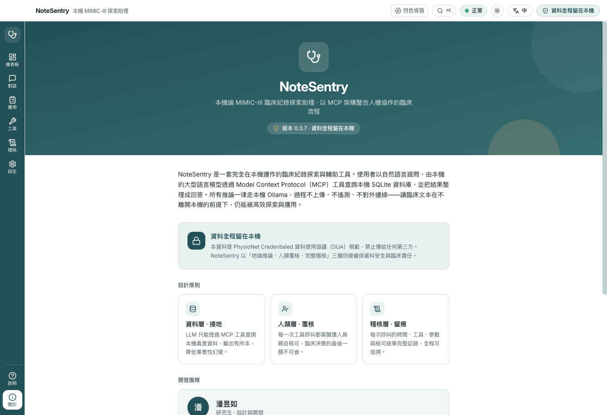

> **圖 22**　關於頁清楚陳述隱私立場與技術組成，作為系統定位的總結。

### 4.11 橫向功能（貫穿全系統）

- **命令面板（⌘K）**：搜尋所有指令並可跳到對話（圖 19）。
- **特色導覽**：首次啟動的聚光燈導覽，逐步介紹各分頁（圖 20）。
- **健康監測**：標題列即時狀態（圖 2）。
- **多語（i18n）**：繁中／English 一鍵切換（圖 25）。
- **無障礙與外觀**：字級、高對比、深色模式、鍵盤焦點可見、螢幕報讀器播報（圖 18）。
- **對話管理**：多對話建立/改名/刪除/搜尋、自動標題、視窗記憶。

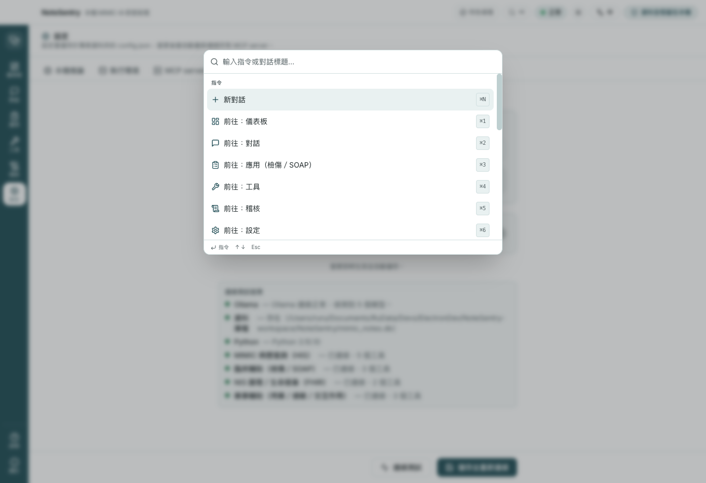
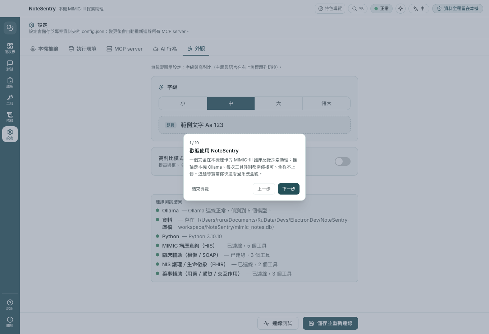
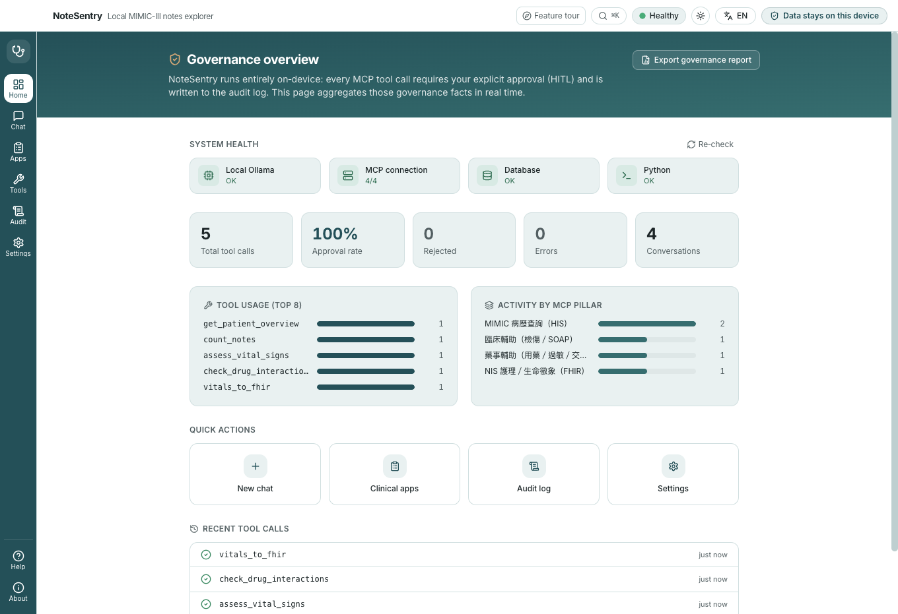

> **圖 19–25**　橫向功能提升可用性與可近用性（含無障礙與雙語），是系統「完成度」的重要佐證。

---

## 5. 模組關聯與資料串聯（一條龍）

```text
[對話 / 應用表單]
      │ 送出提問（自然語言或結構化表單）
      ▼
[本機 Ollama Agent] ──請求呼叫工具──▶ [HITL 人類覆核對話框]  ← 核可/拒絕（無旁路）
      │                                        │ 核可
      ▼                                        ▼
[MCP 路由] ─▶ [四支柱工具（HIS/NIS/LIS/藥事）在本機執行] ─▶ 確定性結果
      │                                        │
      ▼                                        ▼
[LLM 整理答案（串流顯示）]                 [稽核日誌：畫面 + JSONL 落地]
                                               │
                         ┌─────────────────────┼───────────────────────┐
                         ▼                     ▼                       ▼
                 [儀表板即時彙整]        [治理稽核報表匯出]        [個案報告匯出（含 FHIR 表）]
```

**分工說明**：同一份稽核資料被三個出口共用——儀表板（即時可視化）、治理報表（彙總交付）、個案報告（單案交付）；
任務三（接地與 FHIR）與任務四（HITL 與稽核）在這條流程上自然交織。

---

## 6. 作業要求對照表

### 6.1 任務三（系統整合）

| 要求面向 | 系統採用的功能／設計／技術 | 對應分頁 | 成果（截圖） |
| --- | --- | --- | --- |
| 多系統整合（HIS/NIS/LIS/藥事） | **多 MCP 架構**：4 支 FastMCP server、依工具名路由、加法式擴充 | 工具、設定 | 圖 11、16 |
| HIS 病歷查詢 | `mimic` server 5 工具，查詢本機 SQLite，回傳確定性結果（接地） | 對話 | 圖 4 |
| 標準化資料交換（FHIR） | `vitals_to_fhir` 產出 **FHIR R4 Observation Bundle**（LOINC、UCUM、vital‑signs 分類） | 應用 D | 圖 10、24 |
| 標準 MCP 啟動格式 | 設定支援 command/args/env、可匯入標準 mcpServers JSON（同 Claude Desktop） | 設定·MCP | 圖 16 |
| 可發現性／透明 | 工具目錄（live inputSchema）＋ MIMIC 資料字典 | 工具與資料字典 | 圖 11、12 |

### 6.2 任務四（AI 治理）

| 要求面向 | 系統採用的功能／設計／技術 | 對應分頁 | 成果（截圖） |
| --- | --- | --- | --- |
| 人機協作（HITL） | **每次工具呼叫**皆需人工核可，無「全部允許」旁路，Enter/Esc 鍵盤操作 | 對話 | 圖 5 |
| 可問責／稽核軌跡 | 每筆呼叫即時上畫面並落地 `logs/*.jsonl`（時間/工具/參數/決策/結果） | 稽核 | 圖 13、14 |
| 治理可視化 | 儀表板即時彙整核可率、各支柱活動、近期呼叫 | 儀表板 | 圖 1 |
| 可交付治理證據 | 一鍵**治理稽核報表**（摘要＋各工具/server/session＋完整軌跡，HTML/MD） | 治理報表 | 圖 23 |
| 透明性 | 系統提示唯讀預覽、工具/參數字典、答案接地於可檢視的工具結果 | 設定、工具、對話 | 圖 17、11、4 |
| 隱私／合規（DUA） | 本機 Ollama、localhost‑only 阻擋、零外流/零遙測、敏感檔不進版控 | 全系統 | 圖 22 |

> **多模組協作說明**：任務四不由單一畫面達成——HITL（對話）負責「事前控管」、稽核（稽核頁）負責「事中/事後紀錄」、
> 儀表板負責「即時可視化」、治理報表負責「彙總交付」，四者串成完整治理閉環。

---

## 7. 完成成果與特色亮點

- **臨床整合**：四支柱多 MCP、13 工具、FHIR R4 標準輸出，端到端可操作。
- **治理閉環**：HITL 100% 覆核 → 稽核落地 → 儀表板可視化 → 報表交付，完整且可驗證。
- **隱私優先**：本機推論、localhost‑only、DUA 合規、無上傳/無遙測。
- **使用者體驗**：四個結構化應用、命令面板、特色導覽、健康監測、自動標題與後續建議。
- **可近用與雙語**：字級/高對比/深色模式、鍵盤可操作、螢幕報讀器播報、繁中/英文一鍵切換。
- **工程品質（可驗證的完成度）**：
  - 全自動 UI 測試：離線 **51 項**＋`@live`（真模型）＋`@live-tools`（工具核可全流程）＋視覺回歸；
  - **無障礙稽核（axe‑core）納入 CI**；雙語翻譯完整性測試；
  - GitHub Actions CI（ubuntu）＋ 三平台 Release（macOS/Windows/Linux）。
- **可交付產物**：個案報告與治理稽核報表（自包含、可列印、可放入簡報）。

---

## 8. 附錄

### 8.1 鍵盤快捷鍵

| 快捷鍵 | 功能 |
| --- | --- |
| `⌘K / Ctrl+K` | 命令面板 |
| `⌘N` | 新對話 |
| `⌘1–6` | 切換主要分頁 |
| `⌘E` | 匯出目前對話 |
| `Enter / Esc`（HITL） | 核可／拒絕 |

### 8.2 專案目錄結構（重點）

```text
NoteSentry/
├─ src/
│  ├─ main/         # Electron 主行程：MCP 連線、HITL broker、稽核、設定、匯出
│  ├─ preload/      # 安全橋接（contextIsolation）
│  ├─ renderer/     # React UI（各分頁、store、i18n）
│  └─ shared/       # 共用型別與 IPC、i18n 語系檔
├─ mcp/
│  ├─ servers/      # 4 支 FastMCP stdio server（HIS/clinical/pharmacy/nis-fhir）
│  ├─ scripts/      # build_db.py（匯入 NOTEEVENTS → SQLite）
│  └─ README.md
├─ e2e/             # Playwright 全自動 UI 測試（含本截圖擷取腳本）
└─ docs/            # 安裝/規格文件與截圖
```

### 8.3 技術規格摘要

| 項目 | 內容 |
| --- | --- |
| 版本 | v0.3.7 |
| 平台 | Electron（macOS arm64/x64、Windows x64、Linux AppImage/deb） |
| 本機 LLM | Ollama（需支援 tool calling） |
| MCP | 4 server / 13 工具（FastMCP / stdio） |
| 資料 | 本機 SQLite（MIMIC‑III NOTEEVENTS） |
| 標準 | HL7 FHIR R4（Observation、LOINC、UCUM、Bundle） |
| 語言 | 繁體中文 / English |

---

> 本文件與所有截圖均存放於 `docs/screenshots-1/`，圖片以相對路徑引用，可直接作為簡報製作之依據。
