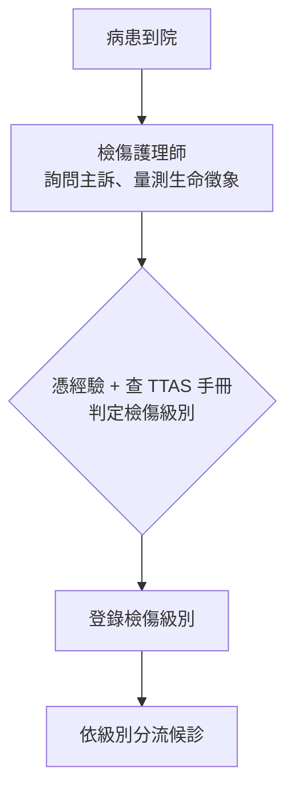
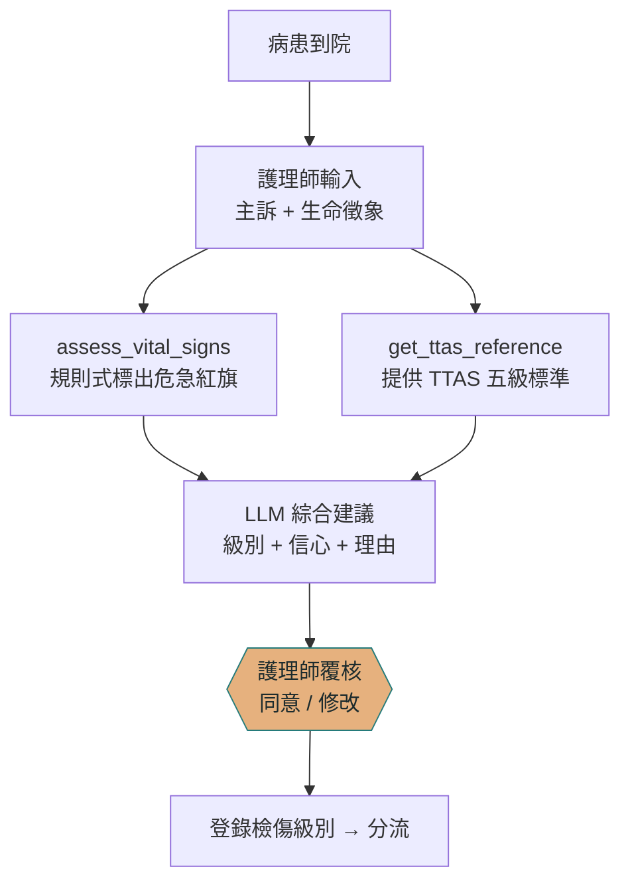
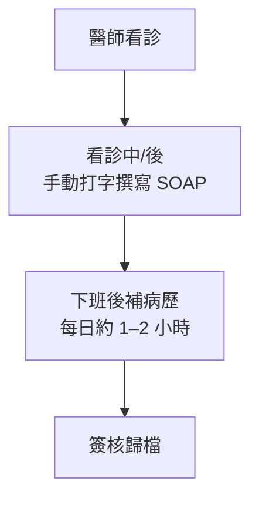
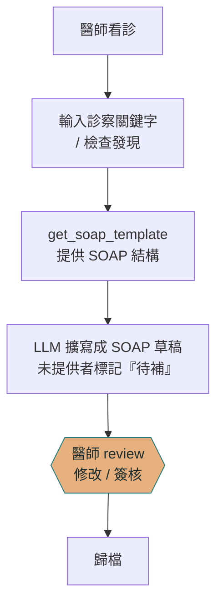

# NoteSentry — 應用 A/B 流程設計與 FHIR 對應

> 報告用素材。流程圖以 mermaid 撰寫，VSCode 預覽與 GitHub 可直接渲染。
> 對應簡報「以 MCP 架構整合人機協作的臨床流程設計」。

---

## 1. 應用 A：LLM 輔助檢傷（As-Is / To-Be）

### As-Is（現行流程）

**痛點**
- 仰賴個人經驗，新手與資深判讀不一致。
- 尖峰時段忙亂，危急數值（如 SpO₂<90、SBP<90）可能被漏看。
- 查檢傷手冊耗時，影響流程速度。

### To-Be（導入 NoteSentry 後）

**改善**
- `assess_vital_signs` 為**確定性規則**，危急數值一定被標記，不漏看（補足注意力缺口）。
- `get_ttas_reference` 提供官方標準，判讀一致、不靠記憶。
- LLM 給「第二意見」，但**最終決定權仍在護理師**（橙色覆核節點）。

---

## 2. 應用 B：LLM 輔助病歷生成（As-Is / To-Be）

### As-Is（現行流程）

**痛點**
- 文書佔醫師約 49% 工時（Sinsky 2016），擠壓與病患互動時間。
- 下班後補病歷，延遲且易出錯。

### To-Be（導入 NoteSentry 後）

**改善**
- 文書時間約 ↓40%（Woo 2026）。
- `get_soap_template` 確保格式一致、欄位齊全；LLM **只就提供的關鍵字擴寫，缺漏標「待補」**，不臆造。
- 即時完成草稿，醫師只需 review／簽核（橙色覆核節點）。
- 不採語音辨識：急診噪音高、空間開放、隱私疑慮。

---

## 3. 八個 MCP 工具 ↔ FHIR Resource 對照

> **MCP 與 FHIR 的關係**：FHIR 是「臨床資料長什麼樣」的互通標準；MCP 是「LLM 如何
> 安全取用」的協定。正式環境中，MCP server 內部即去呼叫醫院的 FHIR API，把結果整理成
> LLM 好用的形狀。本專案目前查的是本機 SQLite（MIMIC-III），下表為**對應到 FHIR 的設計藍圖**。

### server 1：MIMIC 病歷查詢（資料型工具）

| MCP 工具 | 讀取的臨床資料 | 對應 FHIR Resource | 對應欄位 / 搜尋參數 |
| --- | --- | --- | --- |
| `list_note_categories` | 各類臨床文件筆數 | **DocumentReference** | 依 `type`（LOINC 文件碼）彙總 |
| `count_notes` | 文件筆數（帶條件） | **DocumentReference** | `?type=&subject=&date=` |
| `get_patient_overview` | 病患與其文件、住院 | **Patient** + **DocumentReference** + **Encounter** | `Patient.id`、`DocumentReference?subject=`、`Encounter`（住院＝HADM_ID） |
| `search_notes` | 文件內文全文檢索 | **DocumentReference** | `?_content=`（全文搜尋）→ `.content.attachment` |
| `get_note_text` | 單筆文件全文 | **DocumentReference** | `DocumentReference/{id}` → `.content.attachment.data` |

> 對應關係：MIMIC `NOTEEVENTS` 一列＝一份 **DocumentReference**；`CATEGORY`→`type`、
> `SUBJECT_ID`→`subject(Patient)`、`HADM_ID`→`context.encounter`、`CHARTDATE`→`date`、
> `TEXT`→`content.attachment`。

### server 2：臨床輔助（知識／規則型工具）

| MCP 工具 | 性質 | 對應 FHIR Resource | 說明 |
| --- | --- | --- | --- |
| `assess_vital_signs` | 消費生命徵象 | **Observation**（category＝`vital-signs`） | 每項生命徵象＝一個 Observation，帶 LOINC 碼（見下） |
| `get_ttas_reference` | 知識／參考 | **ValueSet / CodeSystem**（檢傷分級碼） | 非病人資料；TTAS 級別可編碼，輸出的分級可記為 `Encounter.priority` 或一筆 triage `Observation` |
| `get_soap_template` | 格式／模板 | **Composition**（SOAP 各段＝`section`） | 非病人資料；產出的 SOAP 病歷可存為 Composition 或 DocumentReference |

**生命徵象的 LOINC 對應**（`assess_vital_signs` 的輸入參數）

| 參數 | 臨床項目 | LOINC |
| --- | --- | --- |
| `spo2` | 血氧飽和（脈衝式） | 59408-5 |
| `heart_rate` | 心跳 | 8867-4 |
| `resp_rate` | 呼吸速率 | 9279-1 |
| `sbp` | 收縮壓 | 8480-6 |
| `dbp` | 舒張壓 | 8462-4 |
| `temperature_c` | 體溫 | 8310-5 |
| `gcs` | 昏迷指數（總分） | 9269-2 |

---

## 4. 三層防線落在流程的哪裡

| 防線 | 機制 | 在流程中的位置 |
| --- | --- | --- |
| 資料層（接地） | `assess_vital_signs`／`get_ttas_reference`／`get_soap_template` 等 MCP 工具把判斷接到確定性依據 | A、B 流程中 LLM 推理「之前」 |
| 推理層（限縮） | 沒接地的個案問題不讓 LLM 臆造；缺漏標「待補」 | LLM 擴寫／建議「當下」 |
| 人類層（覆核） | 護理師／醫師同意、修改、簽核（橙色節點） | A、B 流程的「最後一關」，不可省 |
